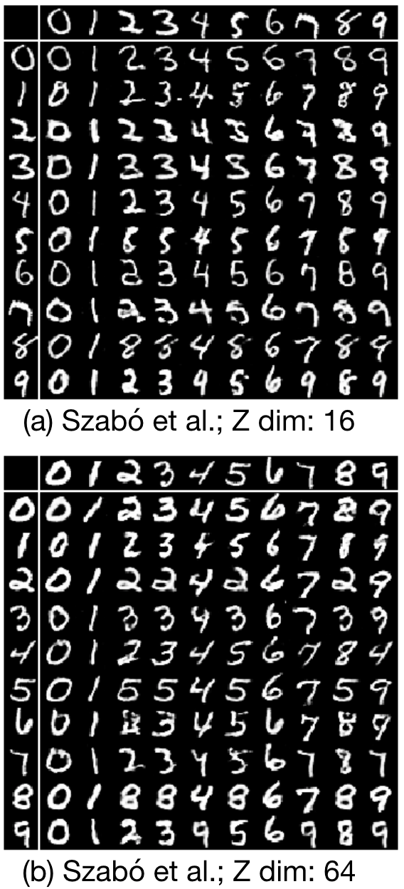
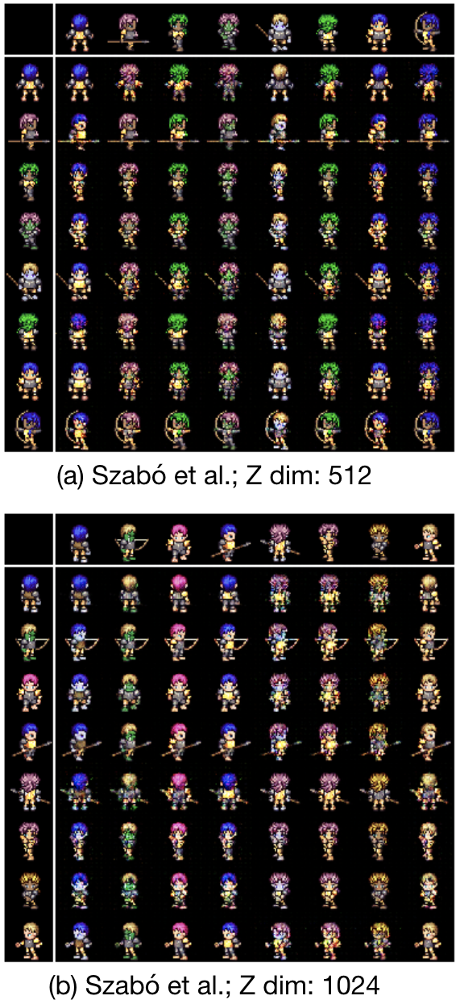
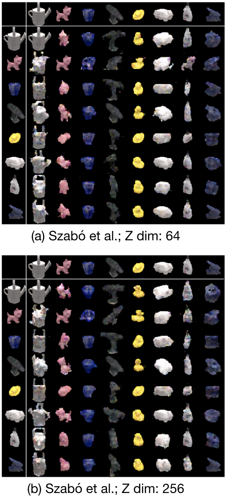
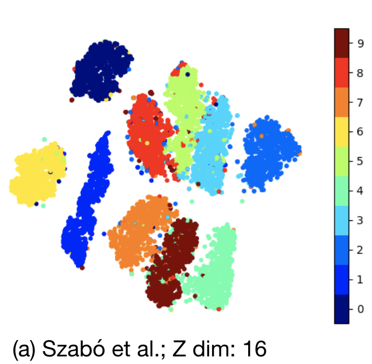

# challenges-in-disentangling

This repository contains the code for the paper: Challenges in Disentangling Independent Factors of Variation (https://arxiv.org/abs/1711.02245),
which was accepted at ICLR 2018's workshop track. This paper proposes an adversarial architecture for disentangling factors of variation.
The architecture differs from the work of Mathieu et al. (https://arxiv.org/abs/1611.03383) by utilizing a regular auto-encoder instead of a VAE.
Also, the adversarial setup used in this work was far more easier to stabilize and train than the one used by  Mathieu et al.

The repository provides files necessary to train this architecture on MNIST dataset, while it can be generalised to other datasets in the paper by changing the **data_loader** and **networks** files.

The code has been tested with the following python interpreter and library versions:

 - python 3.6.3
 - pytorch 0.4.0
 - torchvision 0.2.1
 - argparse 1.1
 - numpy 1.13.3
 - matplotlib 2.2.2
 - tensorboardX 1.2

We have used this work for comparison in our paper: Disentangling Factors of Variation with Cycle-Consistent Variational Auto-encoders (https://arxiv.org/abs/1804.10469).
The code for our work is uploaded at https://github.com/ananyahjha93/cycle-consistent-vae.

## Results

We were able to replicate the visual results of disentangling factors of variation from the paper.
The first column in MNIST, the second is 2D Sprites and the third is LINE-MOD. Z dim here refers to the dimensionality of the
varying component (style latent space) described in the paper.

<table style="width:100%">
    <tr>
        <td align="center"></td>
        <td align="center"></td>
        <td align="center"></td>
    </tr>
</table>

The paper does not use a classifier on the varying component (style latent space) to provide an idea of how much information related to
common factor (class information) in present in it. We ran our own experiments and this in turn helped us to explore few of the
claims of adversarial architectures while disentangling factors of variation.

The following is a t-SNE plot of the varying factor space (style latent space), which ideally should not have any structure
with respect to the class labels of MNIST digits.

In the table below, we present classification accuracies on both the varying factors (style latent space) and
common factors space (class latent space). Ideally, the varying factors space should have as low class accuracy as possible and
the common factors space should have as high class accuracy as possible.

Nv -> varying factors space (style latent space) | Nc -> common factors space (class latent space)

<table style="width:100%">
  <tr>
    <th>Dataset</th>
    <th>Nv dim</th>
    <th>Nc dim</th>
    <th>Nv train acc.</th>
    <th>Nv test acc.</th>
    <th>Nc train acc.</th>
    <th>Nc test acc.</th>
  </tr>
  <tr>
    <td>MNIST</td>
    <td>16</td>
    <td>16</td>
    <td>97.65</td>
    <td>96.08</td>
    <td>98.89</td>
    <td>98.46</td>
  </tr>
  <tr>
    <td>MNIST</td>
    <td>64</td>
    <td>64</td>
    <td>99.69</td>
    <td>98.14</td>
    <td>99.41</td>
    <td>98.05</td>
  </tr>
  <tr>
    <td>2D Sprites</td>
    <td>512</td>
    <td>64</td>
    <td>99.72</td>
    <td>99.63</td>
    <td>99.85</td>
    <td>99.79</td>
  </tr>
  <tr>
    <td>2D Sprites</td>
    <td>1024</td>
    <td>512</td>
    <td>99.79</td>
    <td>99.65</td>
    <td>99.87</td>
    <td>99.76</td>
  </tr>
  <tr>
    <td>LINE-MOD</td>
    <td>64</td>
    <td>256</td>
    <td>100.00</td>
    <td>100.00</td>
    <td>100.00</td>
    <td>100.00</td>
  </tr>
  <tr>
    <td>LINE-MOD</td>
    <td>256</td>
    <td>512</td>
    <td>100.00</td>
    <td>99.97</td>
    <td>100.00</td>
    <td>100.00</td>
  </tr>
</table>
